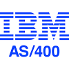

  

# IBM AS/400, TN5250J(JAVA) Demo [AS/400 Test Automation Tests]

This **[repository](https://github.com/YuriiChukhrai/ibm-as-400-demo)** contain the POC for test automation on JAVA, for applications running on the IBM AS/400 OS.

## Introduction
When I am doing an interview of candidates, the previous projects (in git hub or maybe on their machine) are much more critical for me than some fundamental questions about Git, Java, Selenium, Maven, or Jenkins.
We are all people. In an interview, we all can experience anxiety or fear, so I do not believe you can evaluate candidates' many years' background in a couple of hours (even if it is in many panel interviews ~ 8 hours).
I prefer to discuss the candidate demos (explore the code and see how clean it is and what library and why they were used) or discuss their articles in blogs or LinkedIn.

A TN5250J terminal emulator for the IBMi (AS/400) written in Java.

## Dependencies
Make sure you have installed on your operating system: 
1. [JDK. Oracle](http://www.java.com/) OR [OpenJDK](https://openjdk.java.net/)
2. [Git](https://git-scm.com/)
3. [Maven](https://maven.apache.org/)

### Test Suites
The following are valid TestNG test suites for use in the ` -Dtest.suite={test suite name}` parameter: 
1. ` login ` -The simple and straight forward test (Login to IBMi AS/400 system got to menu and logout).

### CLO (Command Line Options)
The following are valid test parameters:
* ` -Dtest.suite` - Which test scenario need to run - TestNG XML file name [login]. 
* ` -Duri.as400 ` - The AS/400 host URI. In our example it's open server **http://pub400.com**
* ` -Duser.as400 ` - The username for login.
* ` -Dpsw.as400 ` - Password
* ` -Dport.as400 ` - The PORT, default value [992].
* ` -Dssl.type.as400 ` - The type of SSL connection, by default it's [TSL].
* ` -DisVisible ` - We can make Java frame invisible for running in the headless mode on Unix-like OS :).
* ` -Preporting` - The Maven profile what enable generation of report (by default reporting disabled).

## Running Tests
The following steps should get you set up for running **Selenium/Selenide** modules locally on your machine:

1. Clone this repository to your local machine: 
    * HTTPS: ` $> git clone https://github.com/YuriiChukhrai/ibm-as-400-demo.git `
    * SSH: ` $> git clone git@github.com:YuriiChukhrai/ibm-as-400-demo.git `  

All commands must be run from the repository folder, cloned during setup process above.  
2. ` $ {project.base.dir}> mvn clean site -Duri.as400=pub400.com -Duser.as400={username} -Dpsw.as400={password} -Dport.as400=992 -Dssl.type.as400=TLS -DisVisible -Dtest.suite=login -Preporting ` - Clean up the `target` directory and run ` login ` test suite.
    **NOTE!** Please, do not forgot to use the Maven profile for report generation ` -Preporting ` if you would like to have SureFire and Allure.  

# Reports
In project exist 3 kind of reports (location: ` {project.base.dir}\target\site\index.html `):
- [TestNG](http://testng.org/doc/documentation-main.html) produce **index.html** report, and it resides in the same test-output folder. This reports gives the link to all the different component of the TestNG reports like Groups & Reporter Output. 
- [Surefire](http://maven.apache.org/surefire/maven-surefire-plugin/) report. The Surefire Plugin is used during the test phase of the build life-cycle to execute the unit tests of an application. 
- [Allure 2](https://docs.qameta.io/allure/) report. An open-source framework designed to create test execution reports clear to everyone in the team. 
  **NOTE!** To run the report (HTML + JS) in Firefox You need leverage the restriction by going to `about:config` url and then **uncheck** `privacy.file_unique_origin` **boolean** value.

## DOC
* [Allure report (HTML+JS)](./doc/ibmi-as-400-demo-allure-report.7z)
* [Video demo (MP4)](./doc/ibmi-main-menu-pub400.mov)

## References
1. [PUB400.COM](https://pub400.com/) - Public AS400 server.
2. [IBM System i](https://en.wikipedia.org/wiki/IBM_System_i) - WikipediA page.
3. [tn5250j.github.io](https://tn5250j.github.io/) OR [GitHub](https://github.com/tn5250j/tn5250j) -  Terminal emulator for the AS/400 written in Java.