# Test Automation for Mainframe (IBMi AS/400)
**TAGS:** `#Mainframe #AS/400 #DB2 #TN5250J #PKMS`

<div style="width:1024px; text-align: justify">
<p>&nbsp;&nbsp;&nbsp;&nbsp;&nbsp;&nbsp;Today, automation must be an integral part of producing any software product, even at the initial development stage. It helps you regression test  and control product quality before going into production, especially when developers are not budgeted enough time for writing unit or integration tests.</p>
<p>&nbsp;&nbsp;&nbsp;&nbsp;&nbsp;&nbsp;For modern projects, be it Web UI or API, you can always find specialized libraries in almost any programming language (for Java, this is usually <a href="https://www.selenium.dev/">Selenium</a> / <a href="https://selenide.org/">Selenide</a> for UI and <a href="https://rest-assured.io">Rest-Assured</a> for API) that will help automate your tests.</p>
<p>&nbsp;&nbsp;&nbsp;&nbsp;&nbsp;&nbsp;But what if the ecosystem includes legacy systems/applications for which modern libraries are not suitable, or the cost of their custom automation is more than budgeted for? What if your E2E script includes steps in UI/API (web-based applications) and interaction with a legacy application, for example, running on OS/400?</p>
<p>&nbsp;&nbsp;&nbsp;&nbsp;&nbsp;&nbsp;This article is about how I adapted open-source software (<a href="https://tn5250j.github.io">a 5250 terminal emulator for the IBMi (AS/400) written in Java</a>) for <a href="https://github.com/YuriiChukhrai/ibm-as-400-demo">test automation</a> applications working on IBMi OS/400.</p>
</div>

# Intro
## Background
<div style="width:1024px; text-align: justify">
<p>&nbsp;&nbsp;&nbsp;&nbsp;&nbsp;&nbsp;At a Silicon Valley-based company, I faced the problem of automating test cases for an application running on OS/400 - <a href="https://docs.oracle.com/cd/E69185_01/cwdirect/pdf/180/cwdirect_user_reference/WH13_01.htm">PKMS</a> (Pick Ticket Warehouse Management Systems). If you Google™ it and do a keyword search for [<a href="https://www.google.com/search?q=AS%2F400+test+automation">AS/400 test automation</a>], you will probably be somewhat disappointed.</p>
<p>&nbsp;&nbsp;&nbsp;&nbsp;&nbsp;&nbsp;Of course, there will be many results intended to sell you a product or service, the content usually lacking what interests me as an engineer:

<li style="padding-left: 50px;">What operating system does this tool run on?</li>
<li style="padding-left: 50px;">What actions are available to me in the SDK?</li>
<li style="padding-left: 50px;">Whether multithreading is supported?</li>
<li style="padding-left: 50px;">Integration with which development languages are implemented?</li>
<li style="padding-left: 50px;">Reporting. Is it possible to take screenshots?</li>

<p>&nbsp;&nbsp;&nbsp;&nbsp;&nbsp;&nbsp;Anyway, after a couple of hours, you begin to understand that someone, somewhere, once had to before you, will attend to the same or similar questions and may even come up with and do something.</p>

<p>&nbsp;&nbsp;&nbsp;&nbsp;&nbsp;&nbsp;In one <a href="https://testguild.com/mainframe-testing/">article</a>, you will find a more detailed description of the companies/products you can use for Mainframe testing.</p>
Here is a shortlist:
<li style="padding-left: 50px;"><a href="https://www.uipath.com/kb-articles/automating-terminals-and-mainframes">Ui Path</a></li>
<li style="padding-left: 50px;"><a href="https://www.microfocus.com/en-us/products/rumba/overview">Rumba + Desktop</a></li>
<li style="padding-left: 50px;"><a href="http://www.jagacy.com/">Jagacy</a></li>
<li style="padding-left: 50px;"><a href="https://github.com/Altran-PT-GDC/Robot-Framework-Mainframe-3270-Library">Altran</a></li>
<li style="padding-left: 50px;"><a href="https://github.com/singe/mainframe_brute">Mainframe Brute</a></li>
<li style="padding-left: 50px;"><a href="https://www.ibm.com/us-en/marketplace/rational-functional-tester">IBM Rational Functional Tester</a></li>
<li style="padding-left: 50px;"><a href="https://www.accelq.com/Enterprise-Tech-Automation">ACCELQ</a></li>

<p>I decided to adopt the open-source software terminal emulator for IBM written in Java for my needs. Let's see what came of it.</p>
</div>

## What is AS/400?
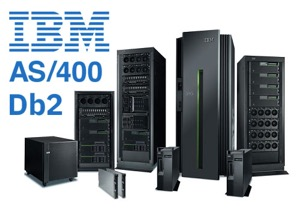</br>
&nbsp;&nbsp;&nbsp;&nbsp;&nbsp;&nbsp;_Figure 1. IBMi Application System/400_

<div style="width:1024px; text-align: justify">
&nbsp;&nbsp;&nbsp;&nbsp;&nbsp;&nbsp;IBM introduced the Application System/400 in 1988. It was an integrated system featuring hardware (AS/400) and an operating system (OS/400), along with many core functions such as an integrated database.
<p>&nbsp;&nbsp;&nbsp;&nbsp;&nbsp;&nbsp;Both the hardware and the software have gone through many upgrades, revisions, and name changes over the years. From the beginning, one of the strongest features of this platform has been its upward compatibility. You can run a program created for the AS/400 in 1988 on a Power Systems server today with little or no changes.</p>
<p>&nbsp;&nbsp;&nbsp;&nbsp;&nbsp;&nbsp;This seamless compatibility is one reason why many companies that purchased an AS/400 years ago continue to refer to it as an AS/400 even though their Power server is an order of magnitude faster and features cutting-edge technologies.</p>
<p>&nbsp;&nbsp;&nbsp;&nbsp;&nbsp;&nbsp;IBM continues to update the platform today. Every two to three years, they release new versions of the hardware and software that feature quantum leaps forward in processing power and functionality.</p>
</div>

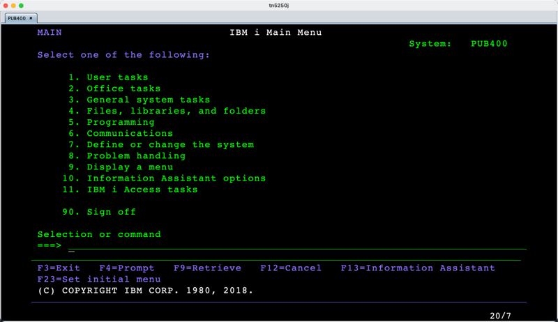</br>
&nbsp;&nbsp;&nbsp;&nbsp;&nbsp;&nbsp;_Figure 2. OS/400 - Main menu_

## PkMS
<div style="width:1024px; text-align: justify">
<p>&nbsp;&nbsp;&nbsp;&nbsp;&nbsp;&nbsp;One of the programs for which I had to implement tests was PkMS.</p>
<p>&nbsp;&nbsp;&nbsp;&nbsp;&nbsp;&nbsp;PkMS (Pick Ticket Management System) is a warehouse management system that controls inventory movement, such as receiving merchandise, inventory transactions, picking and packing, and shipping merchandise to a customer, working under the AS/400 OS (Vendor Manhattan Associates).</p>
</div>

## TN5250J
<div style="width:1024px; text-align: justify">
&nbsp;&nbsp;&nbsp;&nbsp;&nbsp;&nbsp;After a bit of research, I found an open-source terminal emulator, <a href="https://tn5250j.github.io/">TN5250J</a>, for the IBM i (AS/400) written in Java, and this could not but make me happy. After all, if I can interact through this terminal in manual mode, I can do all the same through its source code (creating a kind of API) and use this dependency in any project.

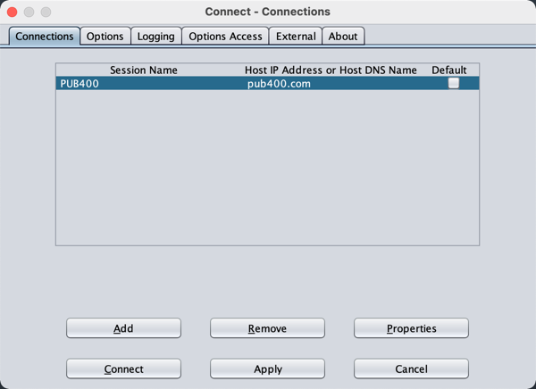</br>
&nbsp;&nbsp;&nbsp;&nbsp;&nbsp;&nbsp;_Figure 3. TN5250J – Connection’s tab_

&nbsp;&nbsp;&nbsp;&nbsp;&nbsp;&nbsp;The TN5250j is a 5250 terminal emulator for the IBMi (AS/400) written in Java. `It was created because there was no terminal emulator for Linux with features like continued edit fields, gui windows, cursor progression fields etc….`</br>
There are 3 modes:

<li style="padding-left: 50px;">A basic mode</li>
<li style="padding-left: 50px;">Enhanced mode that implements the features like masked edit fields and those listed above</li>
<li style="padding-left: 50px;">The third is a gui mode that turns the bland green-screen into a windows gui (See screen shots)</li>

<p>&nbsp;&nbsp;&nbsp;&nbsp;&nbsp;&nbsp;The GUI part comes in by manipulating the 5250 stream and painting the fields like gui constructs in windowing systems, gui looking popup windows in place of windows, painting the <b>PF</b> keys on the screen as buttons (hot spots) so when clicked it will send the appropriate aid key. This is basic gui enhancements that you can receive and interpret from the 5250 stream. Currently that is all <a href="https://tn5250j.github.io/">TN5250J</a> does.</p>
<p>&nbsp;&nbsp;&nbsp;&nbsp;&nbsp;&nbsp;Initially, <a href="https://tn5250j.github.io/">TN5250J</a> GitHub project used <a href="https://ant.apache.org/">Ant</a>, which seemed to be a little inconvenient for my purposes (<a href="https://maven.apache.org/">Maven</a> - will automatically download all dependencies and add them to the pass class, I'm not talking about all the other goodies, which come with it as a build tool). And I transferred it to the <a href="https://maven.apache.org/">Maven</a> project and slightly corrected those bugs found by static analysis (<a href="https://pmd.github.io/">PMD</a>, <a href="https://pmd.github.io/latest/pmd_userdocs_cpd.html">CPD</a>, <a href="https://spotbugs.github.io/">SpotBugs</a>).</p>

I used next tools:
<li style="padding-left: 50px;">Java  (my preferred coding)</li>
<li style="padding-left: 50px;"><a href="https://maven.apache.org/">Maven</a></li>
<li style="padding-left: 50px;"><a href="https://testng.org/doc/">TestNG</a></li>
<li style="padding-left: 50px;"><a href="http://allure.qatools.ru/">Allure</a></li>

&nbsp;&nbsp;&nbsp;&nbsp;&nbsp;&nbsp;After rebuilding a new project, I got this dependency in my local <a href="https://maven.apache.org/">Maven</a> repository :

```XML
<dependency>
    <groupId>org.tn5250j</groupId>
    <artifactId>as400-tn5250j</artifactId>
    <version>0.9.6-SNAPSHOT</version>
</dependency>
```
<p>&nbsp;&nbsp;&nbsp;&nbsp;&nbsp;&nbsp;The resulting dependency is a java-archive file ( *.jar ) of compiled classes, which is the <a href="https://tn5250j.github.io/">TN5250J</a> standalone application. You can run it as a separate GUI application using the command:</p>

`$\> java -jar as400-tn5250j-0.9.6-SNAPSHOT.jar`

<p>&nbsp;&nbsp;&nbsp;&nbsp;&nbsp;&nbsp;The project modified for <a href="https://maven.apache.org/">Maven</a> is no different from the original project. As a real AS/400 operating system for the demo, I will use the PUB400.COM project - a public AS400 server.</p>

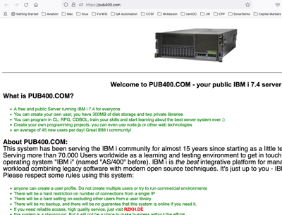</br>
&nbsp;&nbsp;&nbsp;&nbsp;&nbsp;&nbsp;_Figure 4. Web page of project PUB400.COM_
<div>


# Demo
## Intro

<div style="width:1024px; text-align: justify">
<p>&nbsp;&nbsp;&nbsp;&nbsp;&nbsp;&nbsp;So, what is the <a href="https://youtu.be/W2Bkg0rE4v8">demonstration</a> going to be? The test will consist of the following steps:</p>
<li style="padding-left: 50px;">Open the <a href="https://tn5250j.github.io/">TN5250J</a> terminal</li>
<li style="padding-left: 50px;">Login to the public AS/400 server and verify that</li>
<li style="padding-left: 50px;">Go to the [User Task] menu and verify that</li>
<li style="padding-left: 50px;">Go back to [Main menu] and verify that</li>
<li style="padding-left: 50px;">Logoff</li>
<li style="padding-left: 50px;">Attach all test artifacts (screenshots/screen text representation) to <a href="http://allure.qatools.ru/">Allure</a></li>
<li style="padding-left: 50px;">Close the <a href="https://tn5250j.github.io/">TN5250J</a> terminal</li>
<li style="padding-left: 50px;">Generate <a href="http://allure.qatools.ru/">Allure</a> report with the screenshots</li>

&nbsp;&nbsp;&nbsp;&nbsp;&nbsp;&nbsp;Yes, the test is not complicated, but our goal is not to conquer the whole world - this is just a proof of concept (POC). We will run the test itself from the command line using <a href="https://maven.apache.org/">Maven</a>:</br>
`$\> mvn clean site -Duri.as400=pub400.com -Duser.as400={username} -Dpsw.as400={password} -Dport.as400=992 -Dssl.type.as400=TSL -DisVisible`

<p>&nbsp;&nbsp;&nbsp;&nbsp;&nbsp;&nbsp;Of all the options, I would like to stop at [ -DisVisible ]. This option launches the terminal in GUI mode and allows you to see what is happening in the terminal and take screenshots. We just change the field values in the JFrame object ( jframe.setVisible (false or true) ). Without this option, the terminal will start in headless mode (but the representation of screens in the form of strings will remain, and you can attach them to a report). That solution can be used anywhere where Java is available. For my tests, I used <a href="https://www.jenkins.io/">Jenkins</a> Master/Slave nodes on <a href="https://www.redhat.com/en/topics/linux/what-is-centos">CentOS</a> (with/without virtual monitor) to run test automation in CI (pipeline as code / <a href="https://docs.cloudbees.com/docs/admin-resources/latest/automating-with-jenkinsfile/creating-jenkinsfile">JenkinsFile</a>).</p>
<p>&nbsp;&nbsp;&nbsp;&nbsp;&nbsp;&nbsp;A few words about the technical part for working with [ 5250J terminal ] before the demonstration: we will use the dependency of the 5250J emulator in our demo project so that we could use its classes, functions, and resources in our program.</p>

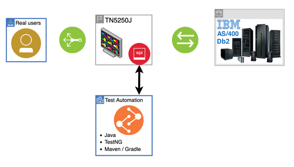</br>
&nbsp;&nbsp;&nbsp;&nbsp;&nbsp;&nbsp;_Figure 5. High level diagram of: 5250J terminal + AS/400 + User actions_

<p>&nbsp;&nbsp;&nbsp;&nbsp;&nbsp;&nbsp;We will proceed with I/O (Input/Output) for the <b>green screen</b> application. The general idea is very similar to <a href="https://www.selenium.dev/">Selenium</a> (a library that allows you to communicate with the browser and send commands to it: open page, click etc.), where the <a href="https://tn5250j.github.io/">TN5250J</a> terminal is an analogue of the browser (which receives HTML + JavaScript and forms a page) - displays the contents of the screens and allows you to fill in various input fields and simulate function keys (<b>F1 - F24</b>).</p>

")</br>
&nbsp;&nbsp;&nbsp;&nbsp;&nbsp;&nbsp;_Figure 6. TN5250J dependency in demo project (Maven)_

<p>&nbsp;&nbsp;&nbsp;&nbsp;&nbsp;&nbsp;<a href="https://www.selenium.dev/">Selenium</a> uses locators to work with HTML elements. Accessible by XPath, ID, CSS, by name, etc. In our case, for AS/400 applications, you need to know their ID (digits) or text label on the screen before/after the input fields to access the input fields.</p>

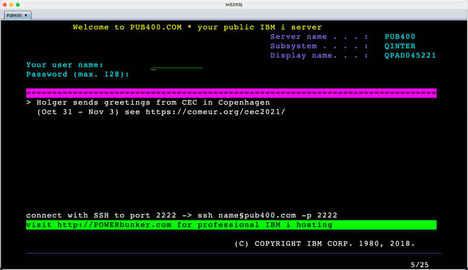</br>
&nbsp;&nbsp;&nbsp;&nbsp;&nbsp;&nbsp;_Figure 7. PUB400.COM – Login_


```TXT
+++++++++++++++++++++++ AS400 screens delimiter +++++++++++++++++++++++
Welcome to PUB400.COM * your public IBM i server
Server name . . . :   PUB400
Subsystem . . . . :   QINTER2
Display name. . . :   DEVNAMETES
Your user name:
Password (max. 128):

===============================================================================
> Hope to see you at the Common Europe Congress in Copenhagen
(Oct 31 - Nov 3) see https://comeur.org/cec2021/


connect with SSH to port 2222 -> ssh name§pub400.com -p 2222
visit http://POWERbunker.com for professional IBM i hosting

(C) COPYRIGHT IBM CORP. 1980, 2018.
+++++++++++++++++++++++ AS400 screens delimiter +++++++++++++++++++++++

```
&nbsp;&nbsp;&nbsp;&nbsp;&nbsp;&nbsp;_Figure 8. A text representation of the AS/400 screens in the 5250J terminal (logged for debug)_

<p>&nbsp;&nbsp;&nbsp;&nbsp;&nbsp;&nbsp;The application screen in AS/400 in the <a href="https://tn5250j.github.io/">TN5250J</a> terminal is represented as an array of characters (each line of the screen is an element in this array). I used <a href="https://en.wikipedia.org/wiki/Regular_expression">Regular Expression</a> to navigate them.</p>
<p>&nbsp;&nbsp;&nbsp;&nbsp;&nbsp;&nbsp;The [<b>SessionBean</b>] class is responsible for communicating with the <a href="https://tn5250j.github.io/">TN5250J</a> terminal to open a session, retrieve screen content, and send some commands or keys.</p>
<p>&nbsp;&nbsp;&nbsp;&nbsp;&nbsp;&nbsp;In the interface [<b>TerminalElementsMethods</b>], I put those methods that I will need for simple manipulations in the demo (such as sendKeys, fillFieldWith, isTextPresent, etc).</p>

![SRC. Interface [TerminalElementsMethods]](./img/terminal-elements-methods.png "SRC. Interface [TerminalElementsMethods]")</br>
&nbsp;&nbsp;&nbsp;&nbsp;&nbsp;&nbsp;_Figure 9. SRC. Interface [TerminalElementsMethods]_

<p>&nbsp;&nbsp;&nbsp;&nbsp;&nbsp;&nbsp;The [<b>TerminalDriver</b>] class contains the implementation of the [<b>TerminalElementsMethods</b>] interface. If you look at them, see how they manipulate the screen as text. The entire screen with its labels and fields is treated as an array of characters.</p>

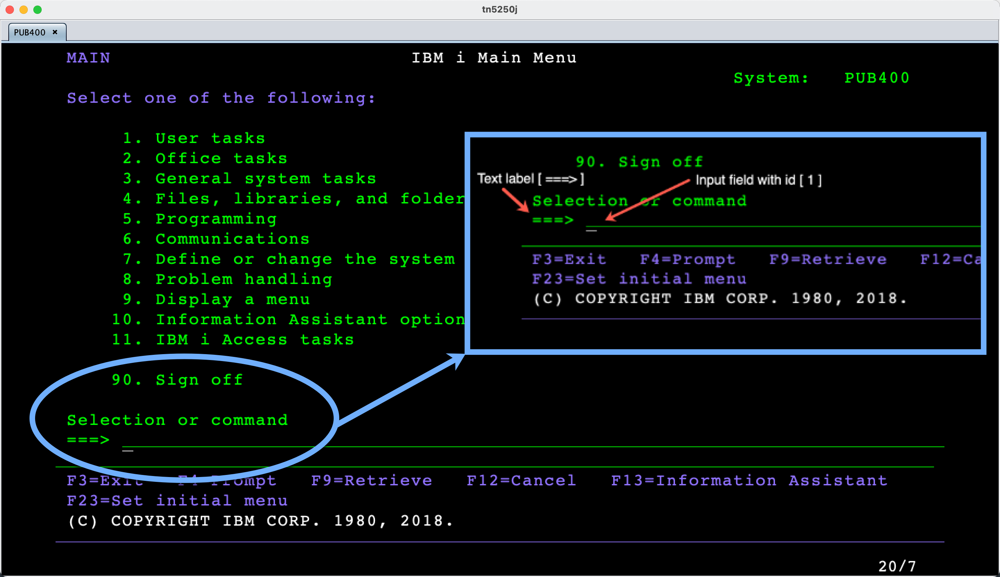</br>
&nbsp;&nbsp;&nbsp;&nbsp;&nbsp;&nbsp;_Figure 10. Text label and field ID on the AS/400 screen_

<p>&nbsp;&nbsp;&nbsp;&nbsp;&nbsp;&nbsp;Since we will be using TestNG (to run our tests) for the convenience of the code, we will define some test fixtures (open/close terminal) in <i>@BeforeTest</i> and <i>@AfterTest</i>.</p>

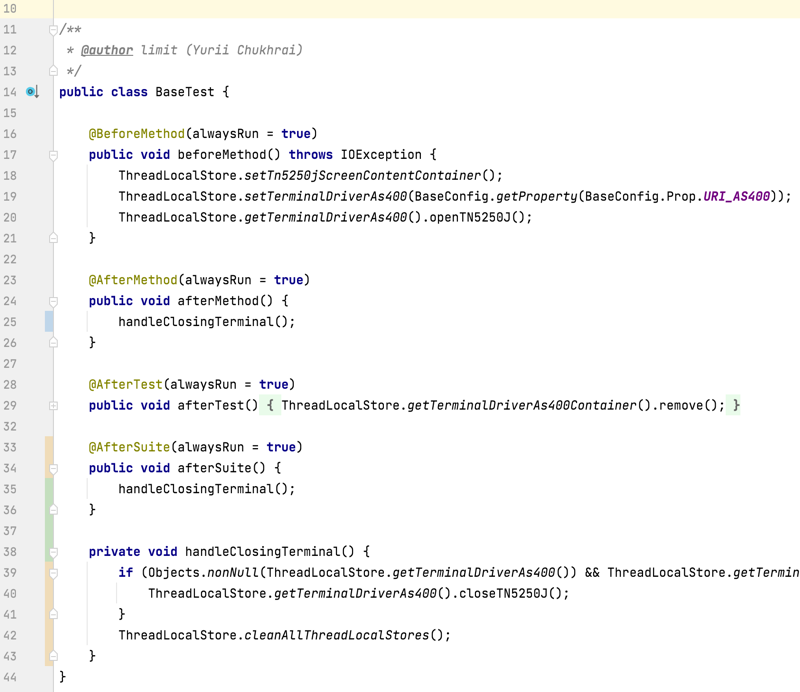</br>
&nbsp;&nbsp;&nbsp;&nbsp;&nbsp;&nbsp;_Figure 11. TestNG @BeforeTest / @AfterTest_

<p>&nbsp;&nbsp;&nbsp;&nbsp;&nbsp;&nbsp;The same applies to the listener for tests - when the test fails, it will take screenshots of the terminal and grab all screens in a text view for a report in <a href="http://allure.qatools.ru/">Allure</a>.</p>

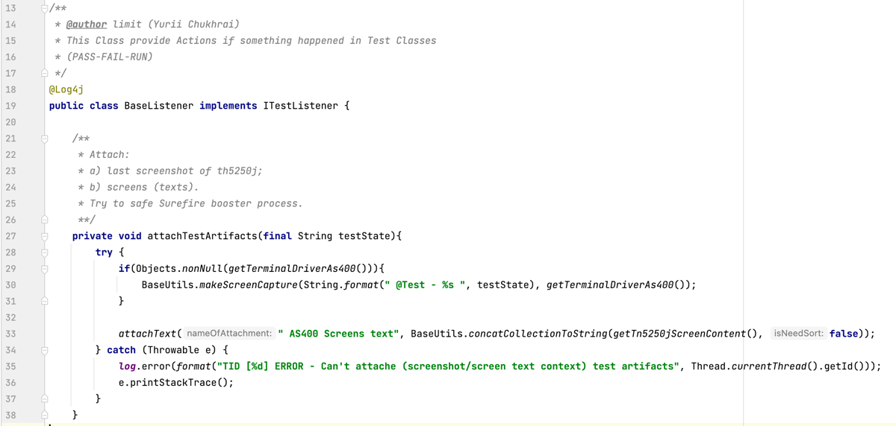</br>
&nbsp;&nbsp;&nbsp;&nbsp;&nbsp;&nbsp;_Figure 12. TestNG @Listener implementation_

<p>&nbsp;&nbsp;&nbsp;&nbsp;&nbsp;&nbsp;The test uses two screens, and their code is written as a <a href="https://www.selenium.dev/documentation/test_practices/encouraged/page_object_models/">Page Object Model</a>. In general, nothing special if you've written (or are writing) tests for web UI applications. The classes in the <a href="https://www.selenium.dev/documentation/test_practices/encouraged/page_object_models/">POM</a> are written so that they allow for chain invocation (just for convenience).</p>

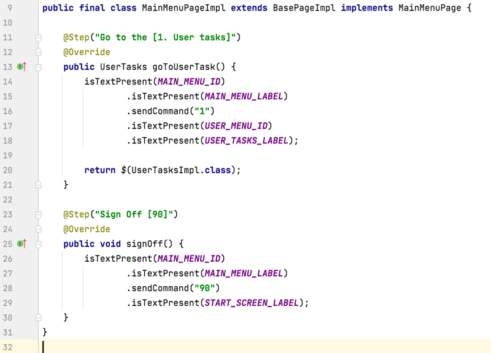</br>
&nbsp;&nbsp;&nbsp;&nbsp;&nbsp;&nbsp;_Figure 13. POM. Main Menu page_

<p>&nbsp;&nbsp;&nbsp;&nbsp;&nbsp;&nbsp;After the above, the test class will turn out to be very concise since the test fixture is defined in <i>@BeforeTest</i> / <i>@AfterTest</i>.</p>

")</br>
&nbsp;&nbsp;&nbsp;&nbsp;&nbsp;&nbsp;_Figure 14. TestNG. Test method implementation (most of annotations related to Allure report)_

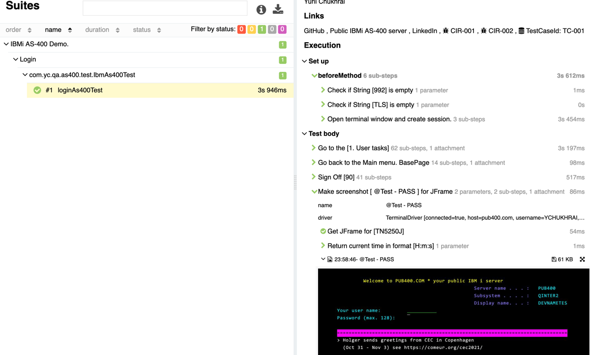</br>
&nbsp;&nbsp;&nbsp;&nbsp;&nbsp;&nbsp;_Figure 15. Allure report_
<div>

# Conclusion
<div style="width:1024px; text-align: justify">
&nbsp;&nbsp;&nbsp;&nbsp;&nbsp;&nbsp;Never say never. The purpose of the demonstration is to show that it is possible, using open-source software (<a href="https://tn5250j.github.io/">TN5250J</a> terminal emulator), to automate the actions of a real user for applications on Mainframe using a set of tools that are standard in Java test automation (<a href="https://maven.apache.org/">Maven</a>, <a href="https://testng.org/doc/">TestNG</a>, and <a href="http://allure.qatools.ru/">Allure</a> report). 
The real work  was in defining unique text labels (before/after) for input fields and identifying their IDs; complexities like the write locators for the <a href="https://www.selenium.dev/">Selenium</a> UI test (dynamic XPath) and a working knowledge of <a href="https://en.wikipedia.org/wiki/Regular_expression">Regular Expression</a> that are part of every SDETs regular work. 
The tests themselves can be multithreaded in any language that supports it (Java, in this example) and integrated into any CI.

<p>&nbsp;&nbsp;&nbsp;&nbsp;&nbsp;&nbsp;The more detailed information you can find in the <a href="https://github.com/YuriiChukhrai/ibm-as-400-demo/">GitHub demo</a> repository.</p>
<p>&nbsp;&nbsp;&nbsp;&nbsp;&nbsp;&nbsp;In [<a href="https://github.com/YuriiChukhrai/ibm-as-400-demo/blob/master/README.md">README.md</a>], you can find a full description of the project and command-line options for a demo project along with:</p>
green screen
<li style="padding-left: 50px;">Links and documentation related to the project <a href="https://tn5250j.github.io/">TN5250J</a> and PUB400.COM</li>
<li style="padding-left: 50px;"><a href="https://github.com/YuriiChukhrai/ibm-as-400-demo/blob/master/doc/ibmi-as-400-demo-allure-report.7z">Zipped Allure report</a> (with attached screenshots and text screen representation)</li>
<li style="padding-left: 50px;"><a href="https://github.com/YuriiChukhrai/ibm-as-400-demo/blob/master/doc/ibmi-main-menu-pub400.mov">Recorded demo of test execution (MOV)</a> or <a href="https://youtu.be/W2Bkg0rE4v8">YouTube link</a></li>
</div>

## P.S. `(Post Scriptum)`
Special thanks to [Scott S Nelson](https://www.linkedin.com/in/theitsolutionist/) for reviewing and commenting on the drafts.

# References
1. [TN5250J](https://tn5250j.github.io)
2. [IBM System i](https://en.wikipedia.org/wiki/IBM_System_i)
3. [helpsystems.com](https://www.helpsystems.com/blog/as400-dead)
4. [PUB400.COM](http://pub400.com)
5. [testguild.com](https://testguild.com/mainframe-testing)
6. [docs.oracle.com](https://docs.oracle.com/cd/E69185_01/cwdirect/pdf/180/cwdirect_user_reference/WH13_01.htm)
7. [Allure](http://allure.qatools.ru/)

## [BACK](../README.md)